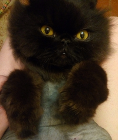

# cat-erik-for-cowsay

This character (cowfile) for the cowsay was created in honor of my cat Eric.
> cowsay version 3.03

`cat-erik.cow` -- this cowfile.

## Installation and use 

 - Copy the file to /usr/share/cowsay/ (`cp cat-erik.cow /usr/share/cowsay/cat-erik.cow`).
 - Type the command `cowsay -f erik Hello everyone`
 - Enjoy!

This is an image of character cowsay

---

This is a picture of my cat Erik

